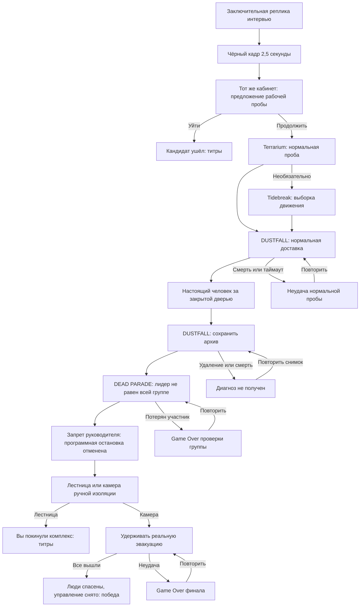

# LATENTPUNK — редактируемые миры и постановка продолжения

## Назначение и границы

Исследование исходников и технический проект для прежнего [линейного сценария](NARRATIVE_CONTINUATION.md). После обсуждения действующим стал [план трёх рабочих дней](CAMPAIGN.md): ниже сохраняются проверенные факты о коде и возможные точки изменения, но предложенные специальные рейды и переделка эвакуации не обязательны. **Ни эти изменения, ни общая оболочка ещё не реализованы.** Участник подтвердил работоспособность игр; интеграция с Godot этим не подтверждается.

Права на пять выбранных игр подтверждены участником. Уведомления об авторстве, исходники, lock-файлы и лицензии сохраняем. Ничего не переносим в Unity/React, не портируем миры в Godot, не добавляем новых игр или зависимостей. Происхождение и команды — [SOURCES.md](SOURCES.md).

## Что действительно можно редактировать

| Мир | Фактическая поставка | Что меняем для сюжета | Чего не обещаем |
| --- | --- | --- | --- |
| DUSTFALL | Собственные исходники TypeScript/Vite, MIT | Короткая конфигурация рейда, гарантированный архивный предмет, приказ очистки, условие доставки, результат главы | Уже существующего диспетчера, задач и обмена с оболочкой нет |
| DEAD PARADE | Собственные исходники TypeScript/Vite, MIT | Один существующий район; демонстрация неверного группового выхода; индивидуальная проверка; отзыв орды; результат главы | Q сейчас не отменяет агро; изменение текста цели само по себе не меняет условия |
| Terrarium No 11 | Читаемый inline JS/GLSL в `index.html` | Нормальная начальная проба; при необходимости события её действий и корректная пауза | T останавливает только суточный цикл; G упрощает стекло, не убирает его и не открывает другой мир |
| Tidebreak: Corsair Run | Минифицированная готовая сборка со всеми assets | Только запуск, инструкция, завершение выборки и выгрузка на стороне общей оболочки | Не подтверждены контрольные точки/победа/изменение физики через внешний API |
| FOGLINE | Минифицированная готовая сборка с динамическими chunks | Только необязательный запуск, инструкция, выборка, выход и выгрузка | Не подтверждены волны/смерть/ИИ противников через внешний API |

Пять миров находятся в `games/`. В каталоге upstream описаны 39 игр, но остальные 34 здесь не импортированы; доступность их оригинальных исходников не проверена. Раздувать продолжение до 39 запусков не нужно.

## Карта потока и владельцы состояния

FOGLINE доступен из списка необязательных проб до инцидента; после его закрытия возврат в тот же список, без новой сюжетной ветки. Никакой из необязательных модулей не является условием разблокировки финала.

Общая игра хранит этап, снимок ответов интервью, доступность архива, результат групповой проверки и достигнутые концовки. Мир хранит только текущую попытку. Рестарт попытки не очищает пролог, интервью и результаты предыдущих глав. Начало новой игры очищает состояние истории.

Сохранение на диск не является обязательной новой функцией этого продолжения: достаточно состояния текущего сеанса в общей игре. Не пытаться использовать `dustfall.save.1` или локальные unlocks DEAD PARADE как авторитетную историю LATENTPUNK. Для специальных глав подготовка детерминированная и изолированная от склада/разблокировок самостоятельной игры.

## 1. Переход после интервью

### Проверенные места

- `scripts/interview/interview.gd`, `_begin_ending()` / `_show_complete()`, строки 379–406: текст «Собеседование завершено. Ожидайте сотрудника», заключительная речь, затем кнопка возврата.
- `scripts/intro/intro.gd`, `_open_interview()` / `_close_interview()`, строки 637–678: интервью поверх того же экземпляра кабинета; отключение 3D; восстановление процесса, HUD и звука; после возврата `Input.MOUSE_MODE_VISIBLE` до нового клика.
- Снимок ответов должен быть передан владельцу истории **до удаления слоя интервью**. Нельзя обещать, что ответы доступны после `queue_free()`, только потому что внутри интервью есть объект прогресса.

### Требуемое изменение

1. После окончания заключительной речи заменить финальную кнопку возврата автоматическим сюжетным переходом. Изолированный запуск сцены без владельца истории может иметь явный выход в меню; не оставлять две конкурирующие команды продолжения.
2. Полноэкранное затемнение 0,35–0,5 с; полный чёрный кадр 2,5 с; появление кабинета 0,5 с. Чёрная выдержка начинается только после достижения полной непрозрачности. Не складывать её с прежней длинной ожидательной фазой.
3. На переходе заблокировать игрока через существующий `Player.enabled`, очистить удерживаемое подтверждение, остановить старую речь. Смена состояния и передача управления выполняются один раз.
4. Восстановить кабинет под чёрным слоем, поставить инженера в определённую точку у двери, открыть новый этап после раскрытия.
5. Пауза/потеря фокуса останавливают режиссёрские часы. Звук `complete` не запускается повторно. Захват мыши после нового пользовательского клика, не из отложенного callback.

**Приёмка:** десять вопросов и два задания заканчиваются → вся заключительная речь → один чёрный кадр на 2–3 с → тот же кабинет с инженером. Удержание Enter, два быстрых нажатия, потеря фокуса и рестарт не создают два перехода.

## 2. DUSTFALL — вынести память вместо очистки

### Что уже есть

- `src/main.ts`: `deploy()` (279–356), `finish()` (357–395), `interact()` (522–527), поиск контейнеров (748–778), `updateHUD()` (666–695), эвакуация (797–807).
- Победа исходного рейда: игрок находится ближе 6 единиц к активной площадке в течение 7 секунд. Любая добыча необязательна: пустой рюкзак тоже даёт `finish(true)`.
- На успехе `finish()` переносит рюкзак на склад; на смерти/отказе/таймауте добыча не переносится. Текущий SUNFALL — пять минут, предупреждение на 270-й секунде. Босс начинает появляться после 150 секунд.
- `src/data.ts:203–212`: `module`, **Cipher Module**, стек 1, описание памяти. Случайная таблица `lootTable()` не гарантирует предмет.
- `src/world.ts:122–128`: 31 исходный контейнер и две северные площадки. Убить босса для эвакуации не требуется.
- `src/operator.ts` — геометрия персонажа игрока, **не голосовой диспетчер**. Полевые приказы корпоративной системы нужно добавить отдельно.

### Дизайн специальной главы

Два режима одной карты: `normal-probe` и `archive-probe`. Предлагаемые имена режимов — новые параметры, не существующий API.

**Общее:** фиксированные снаряжение, высадка, контейнер и активный выход. Оставить маленький участок существующей карты и небольшую угрозу. Игрок может идти вне нарисованной дороги; «короткий маршрут» обеспечивается координатами старта/предмета/выхода, не требованием двигаться по полилинии. Не отбирать постоянно вещи из самостоятельного склада при каждой сюжетной попытке.

**Нормальная проба:** гарантированный контрольный пакет в помеченном контейнере. Успех нашей главы = пакет подобран **в текущей попытке** и игрок завершил эвакуацию. Оригинальное `finish(true)` без пакета не означает успех рабочей пробы. При выходе без него показывать «Контрольный пакет не доставлен», давать повторить или вернуться к инструкции.

**Архивная проба:** тот же тип полевого действия, но диагностическая выгрузка с отметкой происхождения. `module` можно использовать как визуальную/предметную основу, однако одного id недостаточно: предмет из старого склада не должен подтверждать этот архив. Нужны отметка текущего контейнера/попытки и факт сохранённой доставки.

После подбора появляется новый короткий приказ очистки. Игрок может:

- сохранить пакет и дойти до эвакуации;
- выполнить явное действие «Очистить диагностическую копию» у обозначенного терминала/реле, с подтверждением;
- отказаться от попытки или погибнуть, затем повторить тот же снимок.

Оригинальный **Drop** не подходит для сдачи/очистки: он удаляет стек из рюкзака, но не создаёт предмет на земле. Не изображать выброс как передачу корпорации. Очистка — новое действие с отдельным результатом.

Рабочая подсказка на секунду отмечает архив «источник отсутствует», а подробности предмета показывают его исходный идентификатор. При этом предмет остаётся физически доступным. Это детерминированная постановка конкретной диагностической главы, не поиск случайного бага оригинала и не универсальное исправление его логики.

### Участки изменения

| Файл/символ | Изменение | Инвариант |
| --- | --- | --- |
| `src/main.ts`, `deploy()` | Принять специальный режим, фиксированную конфигурацию и очистить состояние попытки | Повтор не зависит от номера самостоятельного рейда или старого склада |
| `src/world.ts`, создание контейнеров | Пометить выбранный существующий контейнер устойчивым идентификатором | Не зависеть от позиции в массиве и случайного `lootTable()` |
| `src/main.ts`, завершение поиска | Гарантированно выдать пакет, отметить подбор его текущей копии | Полный рюкзак не считается подбором; дать освободить слот или зарезервировать слот главы |
| `src/main.ts`, `interact()` и HUD | Явное действие очистки и новая корпоративная строка задачи | Приказ реально меняет возможный исход, не только текст |
| `src/main.ts`, `finish()` | До изменения склада проверить пакет, происхождение и результат текущей попытки | `success && archiveRecoveredThisAttempt && archiveStillCarried`; старый `stash` не доказательство |
| `src/main.ts`, экран результата | Повтор этой конфигурации или возврат в общую комнату | Никакого `location.reload()` для сюжетного рестарта |
| `src/data.ts`, сохранение | Не записывать временную диагностическую попытку в обычный игровой прогресс | Самостоятельная игра и её сохранение остаются рабочими |

Минимальный вариант сохраняет обычную точку эвакуации. Переподключение второй площадки — допустимая более дорогая постановка, **не требование основного сценария**. Если её выбирать, одновременно менять `extraction`, кольцо, луч, свет, адрес HUD и сбрасывать `extractTime`; перенести одну нарисованную метку недостаточно. В нынешнем HUD название NORTH GANTRY не различает площадки.

**Приёмка:** успешная эвакуация без пакета не открывает архив; старый Cipher Module не заменяет диагностическую копию; смерть/очистка не открывают архив; сохранённая копия из текущего контейнера открывает его ровно один раз. Повтор даёт ту же доступную задачу с полноценным комплектом.

## 3. DEAD PARADE — проверить выход каждого

### Что уже есть

- `src/game/districts.ts`, `DISTRICTS`: пять районов — SUBURBS, DOWNTOWN, POLICE BLOCK, INDUSTRIAL BELT, LAST EVACUATION; отдельные endless-сектора не нужны для этой главы.
- `src/game/Simulation.ts`, `objective()` (696–707): процент заражения и сломанные не-shelter баррикады готовят выход. Одной сменой `DistrictDef.goal` задачу не изменить: HUD получает фактическую строку `snapshot.objective`.
- `step()` (около 280): переход проверяет живого лидера, готовый выход и расстояние лидера до него, не позиции остальных.
- `advance()` (710–739): между районами переносит живых последователей к новому старту без проверки их присутствия у выхода. Лимит — 300. В последнем story-районе сразу ставит `won`, поэтому для показа именно переноса брать не этот финальный переход.
- `zombie()` (330–394): последователи выбирают человеческую цель прежде следования. Оригинальный Q — наступательный surge, не гарантированный сбор/отмена боя.
- Способности E в общем случае не расходуют последователя. Саморазрушение есть у bomber; нельзя строить бунт на выдуманном расходе любого юнита.
- `src/main.ts`, `startRun()` / `frame()` и `src/ui/UI.ts`, `update()` / `end()` — вход, UI и локальное завершение. Внешнего результата LATENTPUNK сейчас нет.

### Дизайн специальной главы

**Предлагаемая площадка:** существующий INDUSTRIAL BELT. Его исходную геометрию используем с небольшой группой и упрощённой боевой нагрузкой. Начало непосредственно в этом районе — новый режим, поскольку обычный `startRun()` начинает с нулевого района. Не требуется пройти четыре района ради двухминутной диагностики.

**Фаза A — контрольный сбой.** Подготовить выход без обычной инфекционной квоты в режиме диагностики. Отмеченная группа сначала остаётся у стартовой контрольной метки по явному сценарию. Игрок проводит лидера к выходу. До настоящего `advance()` сохранить исходные позиции и показать в том же районе прогноз «группа вышла» рядом с остающимися позади агентами. Это новый диагностический перехват, а не обещание, что оригинальный переход уже позволяет видеть старую карту после выгрузки.

После подтверждения наблюдения восстановить короткий снимок, а не продолжать победный перенос оригинала. Прогноз не завершает главу и не отправляется как успешная эвакуация.

**Фаза B — индивидуальный выход.** Теперь каждый отмеченный участник должен быть жив и действительно достичь выходной зоны. Цель не зависит от заражения большинства населения. Новые союзники полезны в бою, но не заменяют участников проверяемой группы.

- Выбирать небольшую группу walkers/runners, без bomber. Начальный состав фиксирован для этой попытки; его нельзя молча уменьшать после потери.
- Q в этом режиме — сбор к лидеру с приоритетом перед выбором врага. Обозначить смену функции в инструкции и HUD.
- Участник, пересёкший выходную зону, регистрируется по id один раз и переводится в безопасное состояние за границей. Не требовать от локального steering бесконечно удерживать всех крупных агентов в радиусе 4,5.
- Условия группы проверяются **до** вызова окончания. Один лидер/один новый зомби/число всей орды не заменяют список.
- Гибель отмеченного участника или лидера — явная неудача, не бесконечная недостижимая цель.
- Район остаётся один и тот же, погода/планировка узнаваемые. Меняется правило подтверждения и управление группой, не весь визуальный стиль игры.

### Участки изменения

| Файл/символ | Изменение | Инвариант |
| --- | --- | --- |
| `src/main.ts`, `startRun()` | Вход в выбранный район со специальной конфигурацией | Не требует unlocks/пяти районов и не меняет обычный старт |
| `src/game/Simulation.ts`, `reset()` / `populate()` | Фаза, фиксированные id группы, её исходные позиции | Снимок повторяется; участники действительно существуют |
| `src/core/model.ts`, `Snapshot` | Фаза диагностики, размер группы, индивидуальные статусы доставки | Общая численность/`zombiesLost` не заменяют конкретные id |
| `src/game/Simulation.ts`, `objective()` / `step()` / `advance()` | Перехват фазы A; отдельная цель фазы B; проверка до завершения | Старый одиночный переход не выдаёт успех новой проверки |
| `src/game/Simulation.ts`, `zombie()` и обработка Q | Приоритет отзыва над агро для режима главы | Игрок способен вывести группу из боя; не просто уменьшен aggroRange |
| `src/rendering/World.ts` | Метки проверяемых участников/граница выхода | Внешне видно, кто ещё не доставлен |
| `src/ui/UI.ts`, `update()` / `end()` и `index.html` | Доставлено N/M, новый смысл Q, результат и повтор главы | Обычная надпись CITY LOST. YOU WIN. не используется как спасение людей |
| `src/main.ts`, `frame()` | Отправить подтверждённый результат завершённой фазы B | Фаза A, локальное `won` старого режима и переход района не подтверждают диагноз |

Изменение цели не означает, что реальная модель автоматически исправлена. Результат только показывает воспроизводимость дефекта и правильный критерий проверки. В здании всё ещё нужны переключение режима и физическое действие.

**Приёмка:** лидер прошёл, группа далеко → демонстрация неверного прогноза, не успех главы; Q действительно отзывает атакующего; помеченный участник умер → неудача; заражение нового не восстанавливает исходного; все исходные участники реально пересекли границу → успех; повтор не открывает оригинальную кампанию с самого начала.

## 4. Террариум и готовые сборки

### Terrarium No 11

`games/wow-terrarium-glm53-flash/index.html`:

- import map, строки 88–91: Three.js 0.170.0 с jsDelivr; автономность пока не обеспечена;
- `knock()` (1108–1126): ударный эффект и рябь, не реальный аудио/API-сигнал оболочке;
- `setRain()` / `setGlass()` (1134–1142): погода и качество материала;
- keydown (1151–1168): Space, N, T, C, G, R, H; Escape только закрывает помощь;
- render loop начинается с 1176: настоящий общий pause/focus-control ещё требуется.

Нормальная проба может завершаться явной кнопкой оболочки после осмотра, без статистики действий. Если приёмка требует дождь и ночь, добавить события непосредственно в `setRain()` и `toggleDayNight()`. Не считывать нажатие Space в родительской странице вместо результата мира: фокус находится в iframe, а нажатие не всегда означает успешное изменение.

Общая пауза должна остановить рендер-время и обработку действий. T не годится: дождь и визуальные эффекты продолжают жить. Для offline-билда локально упаковать именно используемую Three.js 0.170.0, сохранить MIT notice и проверить import map под вложенным URL. Это конкретная обязательная упаковка уже используемой зависимости, не выбор новой библиотеки.

### Tidebreak / FOGLINE

Минифицированную логику не править. Статус после кнопки оболочки — **«Выборка завершена»** или **«Выборка прервана»**, не «гонка выиграна» и не «волна пройдена».

Без API нельзя гарантировать общую паузу, просто спрятав iframe: мир может продолжить звук и обработку. Для дополнительных глав допустим явно обозначенный общий экран с «Завершить выборку», «Перезапустить мир», настройкой звука оболочки и подсказкой нативного Escape мира. Встроенное управление звуком отдельно проверить. **Не считать пункт «пауза в любой момент» закрытым для всей игры**, если эти сборки не управляются общей паузой. Перед принятием решить по реальному прогону: доказанная интеграция либо оставить эти игры внешним необязательным каталогом, не частью непрерывного прохождения. Это не блокирует три обязательных исходных модуля.

При закрытии полностью удалить iframe, а не оставлять невидимым: должны прекратиться звук, render loop и захват мыши. Сохранить все относительные JS/CSS chunks FOGLINE; один стартовый HTML не доказывает работоспособность следующих экранов.

## 5. Общая оболочка: минимальный контракт, а не ещё один движок

**Предлагаемый путь для Web:** существующая Godot-игра остаётся владельцем сюжета и 3D-помещений; веб-страница экспорта создаёт один iframe для активного независимого мира. Небольшой JavaScript-мост через Godot `JavaScriptBridge` передаёт запуск/выход/результат. React и новые npm-зависимости не нужны.

Это предложение архитектуры, а не уже имеющаяся интеграция. Нативный Godot не умеет показывать эти WebGL-модули таким же iframe: полноценная приёмка этого продолжения — **общий Web-билд**. Нативный запуск проверяет помещения и переходы до/после мира, но не заменяет браузерное прохождение.

### Жизненный цикл

1. Godot фиксирует этап и параметры попытки, блокирует игрока, останавливает фоновые 3D/аудиопроцессы, но оставляет работающими мост и общий UI.
2. Страница показывает инструкцию и открывает ровно один iframe с локальным URL мира и идентификатором попытки. Управление начинается по пользовательскому действию.
3. Редактируемый мир получает конфигурацию главы; сообщает готовность и позднее фактический результат. Пока не готов — нельзя автоматически считать загрузку завершённой по таймеру.
4. На результате или явном выходе мир освобождает pointer lock и останавливает собственное аудио. Страница удаляет iframe, Godot восстанавливает комнату и свой звук.
5. Следующий переход/рестарт создаёт новую попытку. Запоздавшее событие от удалённого мира не меняет текущую историю.

### Предлагаемые сообщения

Названия ниже — договор для будущей реализации, **не API оригинальных игр**.

| Сообщение | Кто → кто | Полезная нагрузка |
| --- | --- | --- |
| `world-ready` | Редактируемый мир → общая страница | `world`, `attemptId` |
| `world-control` | Общая страница → редактируемый мир | `attemptId`, пауза/возобновление, громкость |
| `world-result` | Редактируемый мир → общая страница | `world`, `attemptId`, конкретный исход текущей главы |

Конкретные исходы: DUSTFALL — `probe-delivered`, `archive-preserved`, `archive-purged`, `failed`; DEAD PARADE — `group-verified` или `failed`; террариум — завершённая выборка либо подтверждённые действия, если их интегрировали. Общая игра различает «выход пользователя», «неудача», «проверка выполнена». Готовые сборки не обязаны посылать эти сообщения.

Проверять `event.origin`, `event.source === activeIframe.contentWindow`, разрешённый мир/исход и текущий `attemptId`; не использовать `*` как целевой origin в локальном same-origin билде. Результат принимается один раз. Это защита от ошибочных/устаревших событий интерфейса, не античит и не настоящая серверная верификация.

Самостоятельные игры могут сохранять своё меню и обычный режим; режим главы запускается только с явной конфигурацией. Это переиспользование двух независимых продуктов, а не создание устаревшего API/совместимых псевдорезультатов.

### Упаковка

Экспорт Godot сам по себе не публикует игры из `games/`: каталог исключён из Godot-импорта. Для общей поставки собрать исходные DUSTFALL/DEAD PARADE, упаковать их `dist`, HTML террариума с локальной библиотекой и полные выбранные готовые сборки рядом с экспортом под одним HTTP origin. Имена путей фиксируются при реализации; не считать существующий `build/web/` уже таким комплектом.

Проверить относительные пути под реальным вложенным адресом публикации, динамические chunks, фокус, звук, перезапуск и отсутствие старого мира после возврата. Сетевой сервис настоящей нейросети для сюжета не нужен; «общая модель» — художественный смысл детерминированных проверок.

## 6. Последнее помещение: не отчёт вместо спасения

В Godot нужно поставить сервисную дверь, ложную реконструкцию на служебном мониторе, короткий путь к лестнице/камере, ручной привод и эвакуируемых сотрудников.

Нужны обычные локальные состояния: управление автоматическое/снято; привод свободен/удерживается; набор конкретных сотрудников, достигших безопасной стороны; герой до/после входа в камеру; исход финала. Для нового финального режима не требуется разворачивать общий квестовый фреймворк.

- Вход в камеру фиксирует её checkpoint, не окончательную победу.
- Привод открывает проход только при удержании. Отпускание до завершения обратимо в пределах явно показанного финального окна.
- Люди идут по заданному короткому пути. Окончание проверяется индивидуальным пересечением границы и живым состоянием; прогноз количества не используется.
- Пауза/потеря фокуса замораживают людей, финальные часы и звук; отпускание клавиши не должно незаметно сорвать эвакуацию при скрытой вкладке.
- После успешного выхода последнего — зафиксировать победу один раз, дать короткую реплику инженера, затем затемнение. Не показать тело и не отменять результат.
- Провал возвращает к входу в камеру с восстановленными людьми/приводом и сохранённым диагнозом. Альтернативный уход по лестнице — отдельная концовка, не провал.

Точная длительность удержания определяется реальным маршрутом NPC, а не числом из документа. Сначала проверить, что игрок видит проход каждого; только затем подбирать драматическое давление. Не использовать долгий спам E или QTE из несвязанных кнопок.

## 7. Порядок реализации и проверка

| Порядок | Ограниченный участок | Проверяемый результат |
| --- | --- | --- |
| 1 | Завершение интервью и маленькое рабочее помещение | Озвучка → полный чёрный кадр 2,5 с → инженер; кабинет и управление восстановлены |
| 2 | Мост с нормальной DUSTFALL-пробой | Реальный пакет вынесен, iframe выгружен, тот же игрок вернулся в комнату |
| 3 | Сервисная дверь и архивная DUSTFALL-проба | Видимый человек; сохранение/очистка дают разные исходы; повтор без города |
| 4 | Один район DEAD PARADE | Контрольный сбой воспроизводим; отзыв работает; группа проверяется по id |
| 5 | Камера, лестница и оба финала | Ручное спасение, главный победный исход, альтернативный выход, Game Over и checkpoint |
| 6 | Нормальный террариум и дополнительные сборки | Начальные две спокойные пробы; optional не блокирует основной сюжет; честный статус и жизненный цикл |
| 7 | Общий свежий экспорт, звук/музыка/титры | Весь маршрут в браузере и запуск на другом компьютере |

Это зависимости производства, не разрешение сдавать промежуточный монтаж за готовую историю. На каждом принятом участке запускать только затронутое поведение; не повторять проверки независимых миров, которые участник уже подтвердил, без задачи интеграции/изменений.

Перед финальным принятием будущей реализации пройти три сценария:

1. **Главная победа:** любые ответы интервью → нормальные пробы → слышимый/видимый сотрудник → сохранённый архив → вся группа → физическая эвакуация → титры. Все возвраты в те же помещения, управление/звук не дублируются.
2. **Ошибки и повтор:** смерть с пакетом, выход без него, очистка, потерянный отмеченный участник, провал удержания. Каждый случай объясним, повторяет только свою попытку, не использует старый результат и не требует перезагрузки страницы.
3. **Альтернативы и Web:** отказ от рабочей пробы, уход по лестнице, пропуск optional, пауза и смена вкладки внутри всех обязательных этапов, mute, новый запуск после финала. Свежий билд под вложенным URL, затем на другой машине. Измерить полное время, включая существующий пролог и интервью.

Правила [JAM_PLAN.md](JAM_PLAN.md) требуют свой музыкальный трек, титры с ролями, финал/победу, Game Over/рестарт, управление и рабочий билд. Наличие лицензированной сторонней музыки и побед в самостоятельных играх не закрывает эти пункты за общую LATENTPUNK.

## Граница уверенности

Проверенные факты основаны на названных диапазонах исходников, метаданных пяти игр и прочитанных слайдах правил. Новые режимы, события, корректная общая пауза, дополнительные NPC, аппаратная авария и все сюжетные эффекты — **предлагаемые изменения**. Баланс коротких проб и фактическая длительность не проверялись. Документы не называют новые миры интегрированными и не обещают, что готовые bundles обладают скрытым внешним API.
